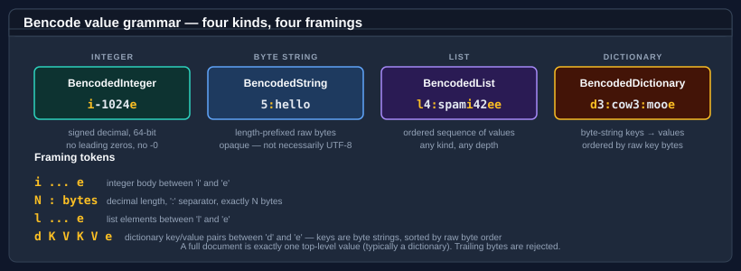

# The `BencodedValue` model

A decoded bencode document is a tree of <xref:Bodu.Text.Bencode.BencodedValue> instances. The base class exposes a single read-only property, <xref:Bodu.Text.Bencode.BencodedValue.Kind>, that returns the matching <xref:Bodu.Text.Bencode.BencodedValueKind> member. Four concrete subtypes implement the four grammar productions.

For the grammar itself see [Core concepts — Value kinds](../../docs/formats/concepts.md#value-kinds).

## Value kinds at a glance



| Subtype | `Kind` | Wire form (example) | Notes |
|---|---|---|---|
| <xref:Bodu.Text.Bencode.BencodedInteger> | `Integer` | `i-1024e` | Signed 64-bit integer; no leading zeros, no `-0`. |
| <xref:Bodu.Text.Bencode.BencodedString> | `String` | `5:hello` | Length-prefixed raw bytes; not necessarily UTF-8. |
| <xref:Bodu.Text.Bencode.BencodedList> | `List` | `l4:spami42ee` | Ordered list of values; constructor rejects null elements. |
| <xref:Bodu.Text.Bencode.BencodedDictionary> | `Dictionary` | `d3:cow3:mooe` | Byte-string keyed; stored sorted by raw byte order. |

## Dispatching on `Kind`

A `BencodedValue` is the lowest common denominator. Real code projects each node to its expected subtype using a switch on `Kind`:

```csharp
using Bodu.Text.Formats;

string Describe(BencodedValue value) => value.Kind switch
{
    BencodedValueKind.Integer    => $"int    {((BencodedInteger)value).Value}",
    BencodedValueKind.String     => $"bytes  {((BencodedString)value).Length}",
    BencodedValueKind.List       => $"list   {((BencodedList)value).Count} items",
    BencodedValueKind.Dictionary => $"dict   {((BencodedDictionary)value).Count} pairs",
    _ => throw new InvalidOperationException("Unreachable: BencodedValueKind is closed."),
};
```

`BencodedValueKind` is a small closed enum. The decoder never produces any other value; the `_` branch in the switch is there only to keep the compiler happy when the enum is later expanded.

## `BencodedInteger`

```csharp
using Bodu.Text.Formats;

var one = new BencodedInteger(1);
var negative = new BencodedInteger(-1_024);
var hugeButLegal = new BencodedInteger(long.MaxValue);

long v = one.Value;
string s = one.ToString();  // "1" (CultureInfo.InvariantCulture)
```

The constructor accepts any `long`. The decoder enforces the BEP 3 invariants on incoming data:

- No leading zeros — `i01e` is rejected with *Bencoded integers cannot contain leading zeros*.
- No negative zero — `i-0e` is rejected with *Negative zero is not a valid bencoded integer*.
- Must fit in `Int64` — values that overflow are rejected with *outside the supported Int64 range*.

`BencodedInteger.Equals(BencodedInteger?)` compares the underlying `long`; `GetHashCode` delegates to `long.GetHashCode`.

## `BencodedString`

`BencodedString` wraps a raw byte payload. It exposes the bytes as `ReadOnlyMemory<byte>` and offers helpers for the text case:

```csharp
using Bodu.Text.Formats;

// From bytes.
var raw = new BencodedString(new byte[] { 0xDE, 0xAD, 0xBE, 0xEF });

// From bytes (span overload — defensively copies).
ReadOnlySpan<byte> span = stackalloc byte[] { 1, 2, 3, 4 };
var fromSpan = new BencodedString(span);

// From text (UTF-8 encoded).
var hello = BencodedString.FromUtf8("hello");

// Project back to text (only valid if the field is known to be UTF-8).
string s = hello.GetUtf8String();   // "hello"

// Length and raw access.
int length = hello.Length;
ReadOnlyMemory<byte> bytes = hello.Bytes;
```

The byte constructors always defensively copy the input, so the caller's source array can be mutated without affecting the value. Equality compares byte sequences:

```csharp
BencodedString.FromUtf8("info") == BencodedString.FromUtf8("info");   // true (Equals is value-based)
```

`ToString()` returns the UTF-8 projection — useful for `Console.WriteLine` and debugger display, but **not** safe for fields that hold raw binary like SHA-1 piece hashes.

## `BencodedList`

A list is an ordered sequence of values. The constructor accepts any `IEnumerable<BencodedValue>` and materializes it once:

```csharp
using Bodu.Text.Formats;

var list = new BencodedList([
    new BencodedInteger(42),
    BencodedString.FromUtf8("spam"),
    new BencodedList([new BencodedInteger(1), new BencodedInteger(2)]),  // nested
]);

int count = list.Count;
BencodedValue first = list[0];
foreach (BencodedValue item in list.Items)
    Console.WriteLine(item.Kind);
```

- `null` elements throw `ArgumentException` with the message *The list cannot contain null values.*
- `null` source enumerable throws `ArgumentNullException`.
- Iteration order is exactly the wire order — lists are not sorted on construction.

`Items` returns an `IReadOnlyList<BencodedValue>`; the indexer is a direct pass-through to the underlying array.

## `BencodedDictionary`

A dictionary maps byte-string keys to values. The constructor accepts an `IEnumerable<KeyValuePair<BencodedString, BencodedValue>>` and stores them in a `SortedDictionary` keyed by <xref:Bodu.Text.Bencode.BencodedStringComparer.Ordinal>:

```csharp
using Bodu.Text.Formats;

var info = new BencodedDictionary([
    new KeyValuePair<BencodedString, BencodedValue>(
        BencodedString.FromUtf8("length"),
        new BencodedInteger(1024)),
    new KeyValuePair<BencodedString, BencodedValue>(
        BencodedString.FromUtf8("name"),
        BencodedString.FromUtf8("hello.bin")),
]);

int count = info.Count;

// Lookup by BencodedString key.
BencodedString lengthKey = BencodedString.FromUtf8("length");
BencodedValue lengthValue = info[lengthKey];

// Lookup by UTF-8 text key.
if (info.TryGetValue("name", out BencodedValue nameValue))
    Console.WriteLine(((BencodedString)nameValue).GetUtf8String());
```

Construction validates the BEP 3 dictionary invariants:

- `null` keys throw *The dictionary cannot contain null keys.*
- `null` values throw *The dictionary cannot contain null values.*
- Duplicate keys throw *The dictionary cannot contain duplicate keys.*

Iteration via `GetOrderedItems()` returns the items in canonical (raw byte) order regardless of insertion order. `Items` exposes the same sequence as an `IReadOnlyDictionary<BencodedString, BencodedValue>` for LINQ-friendly access.

### Lookup overloads

```csharp
// Strict byte-string lookup (zero allocation if the key is already a BencodedString).
info.TryGetValue(someKey, out BencodedValue v1);

// UTF-8 text lookup — allocates a temporary BencodedString.
info.TryGetValue("piece length", out BencodedValue v2);
```

Use the `BencodedString` overload in hot paths where the key is already in canonical form. The `string` overload is the convenience entry point — it converts the input via `BencodedString.FromUtf8` and dispatches through the same lookup.

## `BencodedStringComparer`

The library's dictionary keys are ordered and compared by **raw byte ordinal**, not by Unicode collation. <xref:Bodu.Text.Bencode.BencodedStringComparer.Ordinal> is the singleton comparer that drives this:

```csharp
using Bodu.Text.Formats;

IComparer<BencodedString>          ordering = BencodedStringComparer.Ordinal;
IEqualityComparer<BencodedString>  equality = BencodedStringComparer.Ordinal;

// Use it to build your own SortedDictionary that matches the library's ordering:
var mine = new SortedDictionary<BencodedString, BencodedValue>(BencodedStringComparer.Ordinal);
```

It implements both `IComparer<BencodedString>` and `IEqualityComparer<BencodedString>`. `Compare` does a lexicographic byte-by-byte comparison and breaks ties on length. `Equals` returns `Compare(...) == 0`. `GetHashCode` hashes the byte sequence with `HashCode.Add`.

The comparer is the same one `BencodedDictionary` uses internally; you only need to reach for it if you maintain your own collection of `BencodedString` keys outside the library types.

## Building a tree fluently

For small documents the constructor literals are the most concise form. For larger trees, build the leaves first and assemble the dictionary last:

```csharp
using Bodu.Text.Formats;

static KeyValuePair<BencodedString, BencodedValue> Entry(string key, BencodedValue value) =>
    new(BencodedString.FromUtf8(key), value);

var info = new BencodedDictionary([
    Entry("length",       new BencodedInteger(fileLength)),
    Entry("name",         BencodedString.FromUtf8(fileName)),
    Entry("piece length", new BencodedInteger(pieceLength)),
    Entry("pieces",       new BencodedString(pieceHashes)),
]);

var doc = new BencodedDictionary([
    Entry("announce", BencodedString.FromUtf8(trackerUrl)),
    Entry("info",     info),
]);

byte[] encoded = Bencode.Format(doc);
```

The order in which entries are passed to the constructor does not matter — the dictionary sorts them by raw key bytes on construction, so `Bencode.Format` always emits the canonical key order.

## Where to go next

- **[Using Bencode](bencode.md)** — the codec entry points and the BEP 3 invariants they enforce.
- **[Streams and async I/O](streaming.md)** — buffer lifecycle and cancellation.
- **[Core concepts](../../docs/formats/concepts.md)** — vocabulary refresher.
