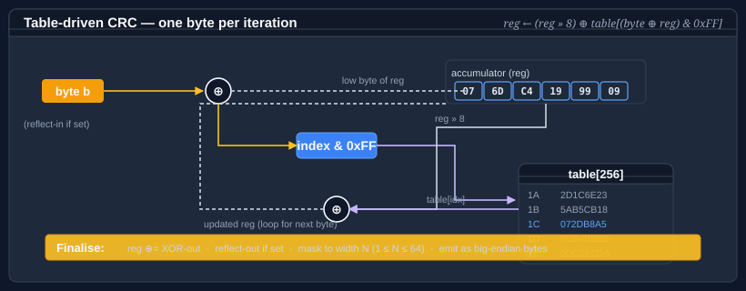

# Using CRC

**Bodu.IO.Hashing** ships a single <xref:Bodu.IO.Hashing.Checksums.Crc> engine that can compute any CRC of widths 1–64 bits. The parameters — polynomial, initial value, input / output reflection, XOR-out — are packed into an immutable <xref:Bodu.IO.Hashing.Checksums.CrcStandard> that you pass to the constructor.



## Pattern 1 — a named standard

The most common standards are exposed as strongly-typed properties. This is the shortest path to a working CRC.

```csharp
using System.Text;
using Bodu.IO.Hashing;

byte[] data = Encoding.UTF8.GetBytes("the quick brown fox");

using var crc = new Crc(CrcStandard.CRC32_ISOHDLC);
crc.Append(data);
string hex = Convert.ToHexString(crc.GetCurrentHash());
```

The default constructor `new Crc()` is equivalent to `new Crc(CrcStandard.CRC32_ISOHDLC)` — the canonical zlib / PNG / Ethernet / PKZIP CRC-32.

## Pattern 2 — pick from the enum

For anything outside the short list of strongly-typed properties, use the <xref:Bodu.IO.Hashing.Checksums.CrcStandards> enum. Every canonical CRC RevEng entry has a member.

```csharp
using Bodu.IO.Hashing;

using var crc16 = new Crc(CrcStandard.Get(CrcStandards.CRC16_XMODEM));
using var crc8  = new Crc(CrcStandard.Get(CrcStandards.CRC8_SAEJ1850));
```

Instances are memoized inside <xref:Bodu.IO.Hashing.Checksums.CrcStandard>, so repeated calls to `Get` for the same entry return the same reference.

## Pattern 3 — look up by name (including aliases)

Canonical names and every published alias resolve to the same standard.

```csharp
using var a = new Crc(CrcStandard.FromName("CRC-32/ISO-HDLC"));
using var b = new Crc(CrcStandard.FromName("PKZIP"));          // same underlying instance
```

`FromName` is ordinal and case-sensitive. `TryFromName` returns `false` instead of throwing when the name is unknown, which is the safer choice for user-supplied configuration.

## Pattern 4 — a custom parameter set

If your target isn't in the catalogue, construct a <xref:Bodu.IO.Hashing.Checksums.CrcStandard> directly.

```csharp
using Bodu.IO.Hashing;

// A hypothetical 12-bit CRC for a bespoke serial frame.
var custom = new CrcStandard(
    name:         "CRC-12/MY-PROTOCOL",
    size:         12,
    polynomial:   0x80F,
    initialValue: 0xFFF,
    reflectIn:    false,
    reflectOut:   false,
    xOrOut:       0x000);

using var crc = new Crc(custom);
```

Widths 1–64 bits are supported. `CrcStandard` validates the width at construction time.

## Pattern 5 — streaming over bytes

Because <xref:Bodu.IO.Hashing.Checksums.Crc> derives from <xref:System.IO.Hashing.NonCryptographicHashAlgorithm?displayProperty=nameWithType>, the BCL streaming helpers apply. Call `Append` as many times as you like, then `GetCurrentHash` to finalize.

```csharp
using Bodu.IO.Hashing;

using var crc = new Crc(CrcStandard.CRC32_ISCSI);

using (FileStream fs = File.OpenRead("archive.bin"))
{
    byte[] buffer = new byte[64 * 1024];
    int read;
    while ((read = fs.Read(buffer, 0, buffer.Length)) > 0)
    {
        crc.Append(buffer.AsSpan(0, read));
    }
}

byte[] fingerprint = crc.GetCurrentHash();
```

`GetCurrentHash` is **non-destructive** — finalization (output reflection, XOR-out, width-masking) is applied to a snapshot of the accumulator, so you can call it repeatedly without disturbing in-progress hashing. To restart from the initial value, call `Reset`.

## Pattern 6 — resume from a stored digest

<xref:Bodu.IO.Hashing.Checksums.Crc> implements <xref:Bodu.IO.Hashing.IResumableHashAlgorithm>, which lets you reverse-finalize a digest you computed earlier, append new bytes, and finalize again. Handy for append-only logs and chunked uploads where rehashing the whole input is expensive.

```csharp
using System.Text;
using Bodu.IO.Hashing;

using var crc = new Crc(CrcStandard.CRC32_ISOHDLC);

byte[] firstDigest = crc.ComputeHash(Encoding.UTF8.GetBytes("the quick brown fox"));

// Later — resume from firstDigest, append a continuation, and finalize.
byte[] combined = crc.ComputeHashFrom(
    previousHash: firstDigest,
    newData:      Encoding.UTF8.GetBytes(" jumps over the lazy dog"));
```

The combined digest is identical to what you'd get from a single pass over the concatenated input.

## Pattern 7 — sharing lookup tables

Every `Crc` instance with the same (width, polynomial, reflect-in) triple shares a single 256-entry lookup table through <xref:Bodu.IO.Hashing.Checksums.Crc.GlobalCache>. This means constructing a hundred `Crc(CrcStandard.CRC32_ISOHDLC)` instances allocates one table, not a hundred.

```csharp
using Bodu.IO.Hashing;

// Process-wide cache, shared across instances.
CrcLookupTableCache cache = Crc.GlobalCache;

// Replace the cache for a test, a benchmark, or isolation between tenants.
Crc.GlobalCache = new CrcLookupTableCache();
```

In practice you'll rarely need to touch the cache directly — the default behavior is what you want.

## Where to go next

- [Using Fletcher](fletcher.md) — the other checksum family in this package.
- [CRC catalogue](crc-catalogue.md) — the full table of 113 named standards.
- [Bodu.IO.Hashing namespace page](xref:Bodu.IO.Hashing) — key types and design notes.
- **[Hashing & Cryptography guides](../topics/hashing-and-cryptography.md)** — every guide in this topic, across Bodu.IO.Hashing and Bodu.Security.Cryptography.
