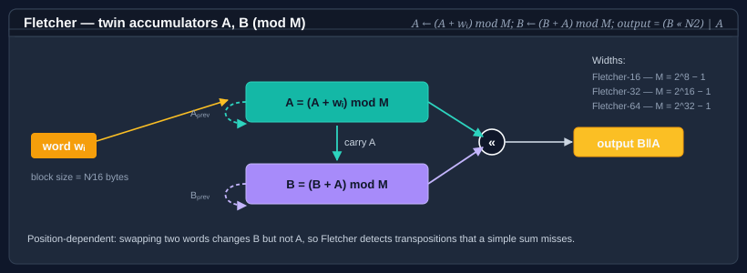

# Using Fletcher

The Fletcher checksum family maintains two running accumulators, **A** and **B**, reduced modulo `M = 2^(N ⁄ 2) − 1` (255 for Fletcher-16, 65535 for Fletcher-32, 4294967295 for Fletcher-64). Each input **byte** updates `A = (A + byte) mod M`, then `B = (B + A) mod M`. The final output is `B ‖ A` written **big-endian**. Because `B` depends on the running `A`, Fletcher catches transpositions — swapping two bytes changes `B` even though the simple sum `A` is unchanged — which a plain additive checksum misses.



**Bodu.IO.Hashing** provides three widths: <xref:Bodu.IO.Hashing.Checksums.Fletcher16>, <xref:Bodu.IO.Hashing.Checksums.Fletcher32>, and <xref:Bodu.IO.Hashing.Checksums.Fletcher64>. All three derive from <xref:System.IO.Hashing.NonCryptographicHashAlgorithm?displayProperty=nameWithType>, share a CRTP `Fletcher<TSelf>` base, and live in the `Bodu.IO.Hashing.Checksums` namespace.

> [!NOTE]
> Bodu's modulus is `2^(N ⁄ 2) − 1`, not a prime. Some descriptions of Fletcher use a prime modulus; this implementation uses the original `2^k − 1` form, which reduces with a fast fold rather than a division. All three widths consume input **one byte at a time** regardless of *N* — there is no word-size blocking.

## Pattern 1 — compute a digest in one call

```csharp
using System.Text;
using Bodu.IO.Hashing.Checksums;

byte[] data = Encoding.UTF8.GetBytes("the quick brown fox");

using var fletcher = new Fletcher32();
fletcher.Append(data);
byte[] digest = fletcher.GetCurrentHash();
string hex = Convert.ToHexString(digest);  // 4 bytes, 8 hex characters, big-endian B‖A
```

Swap `Fletcher32` for `Fletcher16` or `Fletcher64` depending on how much collision space you need.

## Pattern 2 — the `Append` / `GetCurrentHash` / `Reset` lifecycle

The BCL <xref:System.IO.Hashing.NonCryptographicHashAlgorithm?displayProperty=nameWithType> exposes three methods that Fletcher honors verbatim:

```csharp
using Bodu.IO.Hashing.Checksums;

using var fletcher = new Fletcher64();

fletcher.Append(chunk1);                  // update A and B
fletcher.Append(chunk2);                  // continue
byte[] partial = fletcher.GetCurrentHash(); // snapshot, non-destructive
fletcher.Append(chunk3);                  // still works — GetCurrentHash did not change state
byte[] full = fletcher.GetCurrentHash();

fletcher.Reset();                         // back to zeroed A and B
```

`GetCurrentHash` finalizes on a copy of the accumulators, so calling it mid-stream is cheap and safe.

## Pattern 3 — streaming over a file

```csharp
using Bodu.IO.Hashing.Checksums;

using var fletcher = new Fletcher32();

using (FileStream fs = File.OpenRead("archive.bin"))
{
    byte[] buffer = new byte[64 * 1024];
    int read;
    while ((read = fs.Read(buffer, 0, buffer.Length)) > 0)
    {
        fletcher.Append(buffer.AsSpan(0, read));
    }
}

byte[] fingerprint = fletcher.GetCurrentHash();
```

All three widths consume input one byte at a time, so any chunk boundary is safe — `Append` over a 64 KB buffer and `Append` 65 536 times byte-by-byte produce the same digest. The width affects only the modulus and the output size, not how input is fed in.

## Picking a width

| Width | Modulus | Use when | Notes |
|---|---|---|---|
| <xref:Bodu.IO.Hashing.Checksums.Fletcher16> | 255 | Tiny frames, embedded protocols, when 16 bits of collision space is enough. | Fastest; comparable to a CRC-16 for accidental noise on short inputs. |
| <xref:Bodu.IO.Hashing.Checksums.Fletcher32> | 65535 | General-purpose file and buffer checksums; the most common choice. | Cheaper to compute than CRC-32; weaker burst guarantee. |
| <xref:Bodu.IO.Hashing.Checksums.Fletcher64> | 4294967295 | Large buffers where a 32-bit space is uncomfortable. | Rarely needed, but useful for very long streams. |

## What Fletcher catches — and what it misses

Fletcher detects every single-bit error and every adjacent-byte transposition, at a fraction of CRC's per-byte cost. It does not match a CRC's burst guarantee, and the `2^k − 1` modulus introduces a documented blind spot:

- Because `0` and `M` are congruent under the modulus, a byte that should drive an accumulator to `M` leaves it at `0` instead. A run of bytes whose contribution is a multiple of `M` can therefore go undetected.
- A block of all-`0x00` bytes is indistinguishable from an absent block of the same length — both leave `A` and `B` unchanged. Fletcher cannot detect the insertion or deletion of zero bytes.
- There is no per-position burst guarantee of the kind a polynomial CRC provides.

These are acceptable when you control both endpoints and the channel is benign; they are why a wire format that must survive an arbitrary physical link specifies a CRC instead.

## Fletcher vs CRC

- **CRC** is defined by polynomial arithmetic over GF(2). It is better at detecting bursts of errors that align with its polynomial structure. Reach for it when you need to match a standard on the wire (zlib, PNG, Modbus, etc.).
- **Fletcher** is defined by two running sums. It is cheaper to compute on a general-purpose CPU and still catches transpositions. Reach for it when you control both endpoints and want a simple, fast, position-dependent checksum.

Both are **non-cryptographic** — neither resists a motivated adversary. If you need authentication, see the [cryptography hashing guide](../cryptography/hashing.md) (SipHash, Tiger, Merkle trees).

## Where to go next

- [Using CRC](crc.md) — the other checksum family in this package.
- [Bodu.IO.Hashing namespace page](xref:Bodu.IO.Hashing) — key types and design notes.
- **[Hashing & Cryptography guides](../topics/hashing-and-cryptography.md)** — every guide in this topic, across Bodu.IO.Hashing and Bodu.Security.Cryptography.
