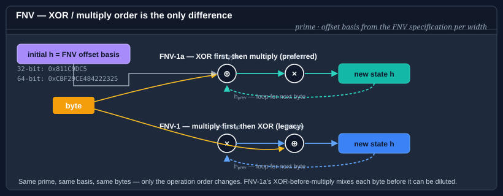

# Using FNV

Fowler–Noll–Vo is a simple, very fast non-cryptographic hash: each input byte multiplies the running state by a prime and then XORs (FNV-1a) or XORs first then multiplies (FNV-1). It has excellent distribution for short strings and is the default hash in a long list of scripting languages, serializers, and hash tables.



**Bodu.IO.Hashing** ships the four canonical widths and variants:

| Type | Width | Variant | When to reach for it |
|---|---|---|---|
| <xref:Bodu.IO.Hashing.Fnv132> | 32 bits | FNV-1 | Classic FNV-1 — legacy interop only. |
| <xref:Bodu.IO.Hashing.Fnv1a32> | 32 bits | FNV-1a | General-purpose 32-bit fingerprint; the default choice at this width. |
| <xref:Bodu.IO.Hashing.Fnv164> | 64 bits | FNV-1 | 64-bit FNV-1 — legacy interop only. |
| <xref:Bodu.IO.Hashing.Fnv1a64> | 64 bits | FNV-1a | General-purpose 64-bit fingerprint; the default choice at this width. |

All four derive from <xref:System.IO.Hashing.NonCryptographicHashAlgorithm?displayProperty=nameWithType> via a shared `Fnv<TSelf>` base, and all four expose the same API.

> **FNV-1a is preferred over FNV-1.** The two variants differ only in the order of the XOR and multiplication — FNV-1a's "XOR first, multiply second" has better avalanche on short inputs and is what most reference implementations choose today. Use FNV-1 only when you need bit-for-bit compatibility with an existing system.

## Pattern 1 — compute a digest in one call

```csharp
using System.Text;
using Bodu.IO.Hashing;

byte[] data = Encoding.UTF8.GetBytes("the quick brown fox");

using var fnv = new Fnv1a64();
fnv.Append(data);
byte[] digest = fnv.GetCurrentHash();
string hex    = Convert.ToHexString(digest);   // 8 bytes, 16 hex characters
```

Substitute `Fnv1a32`, `Fnv164`, or `Fnv132` as needed.

## Pattern 2 — fingerprint a short string for a hash table

The canonical use of FNV is as a hash-table function. The 32-bit width is usually enough for in-process tables; reach for 64 bits when you want to keep the collision probability vanishingly small at a few million entries.

```csharp
using System.Text;
using Bodu.IO.Hashing;

int FingerprintFor(string key)
{
    using var fnv = new Fnv1a32();
    fnv.Append(Encoding.UTF8.GetBytes(key));
    return BitConverter.ToInt32(fnv.GetCurrentHash());
}
```

FNV is **not** keyed. An adversary who can choose inputs can construct collisions trivially — do not use it on data that crosses a trust boundary. For that case, use <xref:Bodu.Security.Cryptography.SipHash64>; see the [cryptography hashing guide](../cryptography/hashing.md).

## Pattern 3 — `AlgorithmName` for logs and diagnostics

Each FNV type exposes an `AlgorithmName` string that captures the variant and width, which is handy for logging or on-wire format headers:

```csharp
using var fnv = new Fnv1a64();
Console.WriteLine(fnv.AlgorithmName);   // "FNV-1a-64"
```

## Pattern 4 — streaming a file

```csharp
using Bodu.IO.Hashing;

using var fnv = new Fnv1a64();

using (FileStream fs = File.OpenRead("archive.bin"))
{
    byte[] buffer = new byte[64 * 1024];
    int read;
    while ((read = fs.Read(buffer, 0, buffer.Length)) > 0)
    {
        fnv.Append(buffer.AsSpan(0, read));
    }
}

byte[] fingerprint = fnv.GetCurrentHash();
```

The update is byte-by-byte internally, so any chunking works — including buffers that cross record boundaries.

## Pattern 5 — `Append` / `GetCurrentHash` / `Reset`

```csharp
using Bodu.IO.Hashing;

using var fnv = new Fnv1a64();

fnv.Append(header);
fnv.Append(body);
byte[] mid = fnv.GetCurrentHash();    // snapshot, non-destructive
fnv.Append(trailer);
byte[] full = fnv.GetCurrentHash();

fnv.Reset();                          // back to FNV offset basis
```

`Reset` restores the algorithm's published offset basis (`0x811C9DC5` for 32-bit, `0xCBF29CE484222325` for 64-bit). You cannot change the offset basis — if you need a different seed, pre-mix the seed bytes into the input before the first `Append`.

## FNV vs the other non-cryptographic hashes in this package

- **vs <xref:Bodu.IO.Hashing.Checksums.Adler32>** — FNV distributes shorter inputs more evenly; Adler is marginally faster on long buffers and is the checksum specified by zlib / PNG.
- **vs <xref:Bodu.IO.Hashing.CityHash64>** — CityHash is substantially faster on long inputs (SIMD-friendly by design) and distributes better on both short and long data. FNV wins on code simplicity and on determinism across languages/libraries.
- **vs <xref:Bodu.IO.Hashing.Checksums.Crc>** — CRC is specified for wire formats and has provably good burst-error detection; FNV is a better default for in-memory fingerprinting where you control both ends.
- **vs <xref:Bodu.Security.Cryptography.SipHash64>** — SipHash is keyed and resists adversarial collisions; FNV does not. Pick SipHash whenever untrusted input can reach the hash function.

## Where to go next

- [Using CityHash](cityhash.md) — the SIMD-friendly modern alternative.
- [Using Adler](adler.md) — twin-accumulator checksum with the same `NonCryptographicHashAlgorithm` shape.
- [Cryptography hashing guide](../cryptography/hashing.md) — when FNV is not enough.
- [Bodu.IO.Hashing namespace page](../../apidoc/Bodu.IO.Hashing.md) — key types and design notes.
