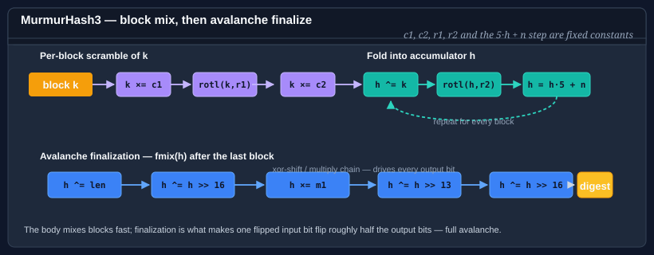

# Using MurmurHash3

MurmurHash3 is a non-cryptographic hash family designed by Austin Appleby (2011) and distributed in the [SMHasher](https://github.com/aappleby/smhasher) reference repository. It produces excellent avalanche behavior — every input bit influences every output bit — and passes all of the standard non-cryptographic hash quality tests. It is widely used in databases, distributed systems, and probabilistic data structures (Bloom filters, HyperLogLog).



**Bodu.IO.Hashing** provides two variants:

| Type | Output | Optimized for | Notes |
|---|---|---|---|
| `MurmurHash3_32` | 32 bits | All platforms | General-purpose 32-bit fingerprint. |
| `MurmurHash3_128` | 128 bits | 64-bit platforms | 128-bit fingerprint; the highest-quality variant. |

Both derive from <xref:System.IO.Hashing.NonCryptographicHashAlgorithm?displayProperty=nameWithType> via a shared `MurmurHash3<T>` base. Both buffer their input internally, consistent with MurmurHash3's one-shot design.

> **Not cryptographic.** MurmurHash3 must not be used for password hashing, digital signatures, or any application that requires adversarial collision resistance. An attacker who can choose inputs can construct collisions. For adversary-facing use, reach for <xref:Bodu.Security.Cryptography.SipHash64>.

## Pattern 1 — compute a 32-bit digest

```csharp
using System.Text;
using Bodu.IO.Hashing;

byte[] data = Encoding.UTF8.GetBytes("the quick brown fox");

using var murmur = new MurmurHash3_32();
murmur.Append(data);
byte[] digest = murmur.GetCurrentHash();   // 4 bytes
uint h = BitConverter.ToUInt32(digest);
```

## Pattern 2 — compute a 128-bit digest

```csharp
using System.Text;
using Bodu.IO.Hashing;

byte[] data = Encoding.UTF8.GetBytes("the quick brown fox");

using var murmur = new MurmurHash3_128();
murmur.Append(data);
byte[] digest = murmur.GetCurrentHash();   // 16 bytes
```

Use the 128-bit variant when you need a wider fingerprint space — for example, as a Bloom filter hash or as a deduplication key over a large corpus.

## Pattern 3 — seeded hash for independent lanes

Both variants accept a `seed` at construction time. Two instances with different seeds produce independent hash functions over the same input, which is useful for Bloom filters (which need multiple independent hashes) and for A/B routing.

```csharp
using Bodu.IO.Hashing;

// Two independent 32-bit hash functions over the same data.
using var h1 = new MurmurHash3_32(seed: 0x00000001u);
using var h2 = new MurmurHash3_32(seed: 0x00000002u);

h1.Append(data);
h2.Append(data);

uint slot1 = BitConverter.ToUInt32(h1.GetCurrentHash()) % (uint)buckets;
uint slot2 = BitConverter.ToUInt32(h2.GetCurrentHash()) % (uint)buckets;
```

The seed is not a cryptographic key — it does not provide adversarial resistance.

## Pattern 4 — `Append` / `GetCurrentHash` / `Reset` lifecycle

MurmurHash3 is a one-shot algorithm internally. The `Append` calls accumulate bytes in an internal buffer; `GetCurrentHash` applies the full mixing pass once all data is available. The call is non-destructive — the buffer is preserved so you can continue appending after a snapshot.

```csharp
using Bodu.IO.Hashing;

using var murmur = new MurmurHash3_32();

murmur.Append(header);
murmur.Append(body);
byte[] partial = murmur.GetCurrentHash();   // snapshot — mixes all bytes appended so far
murmur.Append(trailer);
byte[] full = murmur.GetCurrentHash();

murmur.Reset();                             // discards the buffer and resets to seed
```

> **Memory note.** The internal buffer grows with each `Append`. For very large inputs (hundreds of MB) where you do not want to hold the entire payload in memory, prefer a streaming algorithm such as <xref:Bodu.IO.Hashing.Fnv1a64>, <xref:Bodu.IO.Hashing.Crc>, or <xref:Bodu.IO.Hashing.Fletcher32>.
> **Memory note.** The internal buffer grows with each `Append`. For very large inputs (hundreds of MB) where you do not want to hold the entire payload in memory, prefer a streaming algorithm such as <xref:Bodu.IO.Hashing.Fnv1a64>, <xref:Bodu.IO.Hashing.Checksums.Crc>, or <xref:Bodu.IO.Hashing.Checksums.Fletcher32>.

## Pattern 5 — Bloom filter with two hash functions

```csharp
using System.Text;
using Bodu.IO.Hashing;

const int M = 1_000_000;   // bit-array size

bool[] bits = new bool[M];

void Insert(string item)
{
    byte[] key = Encoding.UTF8.GetBytes(item);

    using var h1 = new MurmurHash3_32(seed: 1);
    using var h2 = new MurmurHash3_32(seed: 2);

    h1.Append(key);
    h2.Append(key);

    int slot1 = (int)(BitConverter.ToUInt32(h1.GetCurrentHash()) % (uint)M);
    int slot2 = (int)(BitConverter.ToUInt32(h2.GetCurrentHash()) % (uint)M);

    bits[slot1] = true;
    bits[slot2] = true;
}

bool MightContain(string item)
{
    byte[] key = Encoding.UTF8.GetBytes(item);

    using var h1 = new MurmurHash3_32(seed: 1);
    using var h2 = new MurmurHash3_32(seed: 2);

    h1.Append(key);
    h2.Append(key);

    int slot1 = (int)(BitConverter.ToUInt32(h1.GetCurrentHash()) % (uint)M);
    int slot2 = (int)(BitConverter.ToUInt32(h2.GetCurrentHash()) % (uint)M);

    return bits[slot1] && bits[slot2];
}
```

## MurmurHash3 vs the other fingerprints

| Criterion | MurmurHash3 | FNV-1a | CityHash | BCL xxHash |
|---|---|---|---|---|
| Output widths | 32 · 128-bit | 32 · 64-bit | 32 · 64 · 128-bit | 32 · 64 · 128-bit |
| Seed support | Yes | No (fixed offset basis) | No | Limited (BCL contract) |
| Streaming (constant memory) | No — buffers input | Yes | No — buffers input | No — buffers input |
| Relative throughput (large inputs) | Good | Moderate | Excellent | Excellent |
| Distribution quality | Excellent | Good | Excellent | Excellent |

Reach for **MurmurHash3** when you need a seeded 32- or 128-bit fingerprint with high-quality avalanche — for Bloom filters, consistent hashing, and bucketing. For the fastest throughput on large buffers, prefer **CityHash** (in Bodu) or `System.IO.Hashing.XxHash64` (in the BCL). For constant-memory streaming, prefer **FNV-1a** or **CRC**.

## Where to go next

- [Using CityHash](cityhash.md) — fastest throughput on large inputs.
- [Using FNV](fnv.md) — constant-memory streaming alternative.
- [Using Pearson](pearson.md) — configurable output width from 8 to 2048 bits.
- [Bodu.IO.Hashing introduction](../../docs/io-hashing/index.md) — when to use a fingerprint vs a checksum vs a check digit.
- [Bodu.IO.Hashing namespace page](../../apidoc/Bodu.IO.Hashing.md) — key types and design notes.
