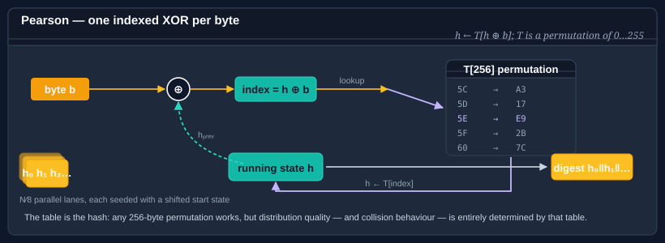

# Using Pearson

Peter Pearson's 1990 hash is a table-driven function with a single simple rule: for each input byte `b`, set `h = T[h XOR b]`, where `T` is a **permutation** of the 256 byte values. The permutation's quality defines the hash's distribution, and because the update is one indexed XOR per byte, it is both very fast and very easy to extend to arbitrary output widths by running several parallel accumulators with shifted starting states.



**Bodu.IO.Hashing** provides a single <xref:Bodu.IO.Hashing.Pearson> type with:

- An output size configurable from **8 bits to 2048 bits** in 8-bit steps.
- A choice of four built-in permutation tables, plus a **user-defined** table.

The type derives from <xref:System.IO.Hashing.NonCryptographicHashAlgorithm?displayProperty=nameWithType>.

## Pattern 1 — the canonical 8-bit Pearson

The parameterless constructor gives you the classic single-byte Pearson hash with Pearson's original permutation table.

```csharp
using System.Text;
using Bodu.IO.Hashing;

byte[] data = Encoding.UTF8.GetBytes("example");

using var pearson = new Pearson();        // 8-bit output, Pearson's canonical table
pearson.Append(data);
byte[] digest = pearson.GetCurrentHash();  // 1 byte
```

An 8-bit hash is only useful as a coarse bucket index — 256 distinct buckets before guaranteed collisions. For anything more interesting, pick a wider width.

## Pattern 2 — a wider output

Any width from 8 to 2048 bits in 8-bit steps is supported. The implementation runs one parallel accumulator per output byte, each seeded with a different offset into the table; their concatenation is the final digest.

```csharp
using Bodu.IO.Hashing;

// 128-bit Pearson with the canonical permutation.
using var pearson = new Pearson(hashSizeBits: 128, tableType: PearsonTableType.Pearson);
pearson.Append(data);
byte[] digest = pearson.GetCurrentHash();  // 16 bytes
```

`hashSizeBits` must be a multiple of 8 between `Pearson.MinHashSizeBits` (8) and `Pearson.MaxHashSizeBits` (2048).

## Pattern 3 — pick a permutation table

The table defines the hash. Bodu ships five choices:

| `PearsonTableType` | Source |
|---|---|
| `Pearson` | Pearson's original 1990 table — the historically canonical choice. |
| `AESSBox` | The AES S-box, used as a permutation (it already is one). |
| `CRC32HighByte` | The high byte of the standard CRC-32 lookup table. |
| `SHA256Constants` | A permutation derived from SHA-256's round constants. |
| `UserDefined` | A 256-byte permutation you supply. |

```csharp
using Bodu.IO.Hashing;

using var pearson = new Pearson(hashSizeBits: 64, tableType: PearsonTableType.AESSBox);
```

All four built-in tables are **permutations** — every byte 0–255 appears exactly once. This is the property Pearson relies on; it is checked at construction time, so a table with duplicates or missing values is rejected.

## Pattern 4 — a user-supplied table

Pass a 256-byte permutation directly to the constructor:

```csharp
using Bodu.IO.Hashing;

byte[] permutation = BuildMyPermutation();   // must be a permutation of 0..255

using var pearson = new Pearson(hashSizeBits: 256, permutationTable: permutation);
```

Constructing `Pearson` with `permutationTable`:

- Validates that the array is exactly 256 bytes long and is a valid permutation (every value 0–255 appears exactly once).
- Clones the array, so later mutation of your buffer does not affect the hash.
- Reports `TableType == PearsonTableType.UserDefined`.

You can read the table back (as a clone) through the `Table` property — handy for round-tripping the configuration or for diagnostics:

```csharp
byte[] tableCopy = pearson.Table;
```

## Pattern 5 — `Append` / `GetCurrentHash` / `Reset`

Pearson follows the standard `NonCryptographicHashAlgorithm` lifecycle:

```csharp
using Bodu.IO.Hashing;

using var pearson = new Pearson(hashSizeBits: 64, tableType: PearsonTableType.Pearson);

pearson.Append(chunk1);
pearson.Append(chunk2);
byte[] partial = pearson.GetCurrentHash();   // snapshot, non-destructive
pearson.Append(chunk3);
byte[] full = pearson.GetCurrentHash();

pearson.Reset();                             // back to the initial offsets
```

`GetCurrentHash` finalizes on a copy, so mid-stream snapshots are cheap and do not disturb in-progress hashing.

## Pearson vs the other non-cryptographic hashes

- **vs <xref:Bodu.IO.Hashing.Fnv1a32>** — FNV-1a has better distribution on short inputs and no table memory footprint. Pearson wins when you need a specific output width (e.g. 96 or 160 bits) without stretching a native-width hash.
- **vs <xref:Bodu.IO.Hashing.CityHash64>** — CityHash is much faster on long inputs and distributes better. Reach for Pearson when you want the table to be a tunable parameter — e.g. in academic work on hash-function quality.
- **vs <xref:Bodu.IO.Hashing.Checksums.Crc>** — CRC is specified for wire formats and has provable burst-error detection. Pearson is a general-purpose fingerprint, not a checksum with error-detection guarantees.

Pearson is **not cryptographic**. Choosing a different table does not make it adversary-resistant — an attacker who knows the table can construct collisions immediately. For adversarial settings, use <xref:Bodu.Security.Cryptography.SipHash64>.

## Where to go next

- [Using FNV](fnv.md), [Using CityHash](cityhash.md) — faster, table-free alternatives.
- [Classic string hashes](string-hashes.md) — Bernstein, BKDR, SDBM, Elf64, and siblings with a similar "one-liner" feel.
- [Cryptography hashing guide](../cryptography/hashing.md) — when Pearson is not enough.
- [Bodu.IO.Hashing namespace page](xref:Bodu.IO.Hashing) — key types and design notes.
- **[Hashing & Cryptography guides](../topics/hashing-and-cryptography.md)** — every guide in this topic, across Bodu.IO.Hashing and Bodu.Security.Cryptography.
