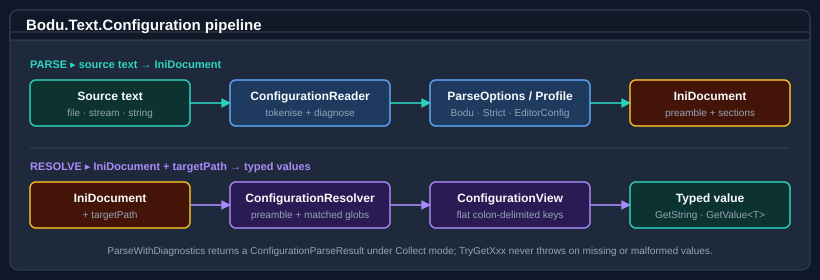

# Bodu.Text.Configuration guides

Recipe-style walk-throughs for **Bodu.Text.Configuration**.

If you are new to the library, start with the [introduction](../../docs/text-configuration/index.md), the
[Core concepts](../../docs/text-configuration/concepts.md) glossary, and the
[getting-started page](../../docs/text-configuration/getting-started.md). The guides below assume you know the
vocabulary (document, view, profile, target path, preamble, glob pattern, key mapping, unset, diagnostic mode).

## How the library works

A configuration document is parsed once and then projected — through a target path — into a flat
<xref:Bodu.Text.Configuration.ConfigurationView>. The reader produces an immutable
<xref:Bodu.Text.Ini.IniDocument>; the resolver layers the preamble plus matching glob-anchored sections in source
order; the view exposes typed accessors that return the effective value for each colon-delimited key.

## Namespace map

| Namespace | What lives here | Static docs |
|---|---|---|
| `Bodu.Text.Configuration` | Static façade (`ConfigurationDocument`), resolved view (`ConfigurationView`), profile and option types (`ConfigurationParseOptions`, `ConfigurationResolveOptions`, `ConfigurationWriteOptions`, `ConfigurationKeyOptions`), key model (`ConfigurationKey`), diagnostics (`ConfigurationDiagnostic`, `ConfigurationParseResult`), and the resolver pattern engine (`ConfigurationPattern`). | [Introduction](../../docs/text-configuration/index.md) · [Core concepts](../../docs/text-configuration/concepts.md) · [Getting started](../../docs/text-configuration/getting-started.md) |

## Where to go next

- **[Introduction](../../docs/text-configuration/index.md)** — namespaces, headline types, scenarios.
- **[Core concepts](../../docs/text-configuration/concepts.md)** — full vocabulary.
- **[Getting started](../../docs/text-configuration/getting-started.md)** — install + runnable minimal samples.
- **[Bodu.Text.Configuration API reference](../../apidoc/Bodu.Text.Configuration.md)** — full type-by-type docs.
- **[Bodu.Extensions.Configuration.Text](../extensions-configuration-text/index.md)** — the `Microsoft.Extensions.Configuration` bridge.
- **[Bodu.Text.Formats](../formats/index.md)** — the underlying `IniDocument` model.
