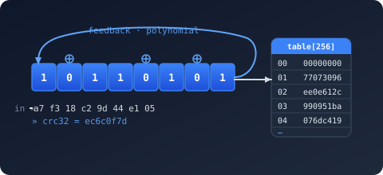
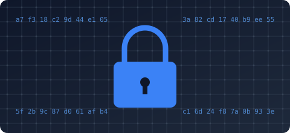
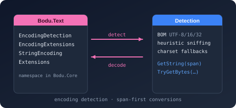
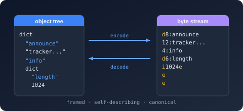
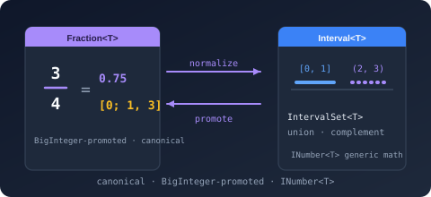
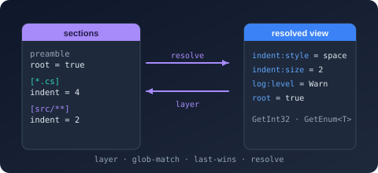

<style>
  .bodu-hero { margin: 1.5rem 0 2.5rem; }
  .bodu-hero h1 { margin: 0 0 .25rem; font-size: 2.2rem; letter-spacing: .5px; }
  .bodu-hero p.tagline { font-size: 1.15rem; opacity: .85; margin: 0 0 .5rem; max-width: 56rem; }
  .bodu-cards { display: grid; grid-template-columns: repeat(auto-fit, minmax(260px, 1fr)); gap: 1rem; margin: 1.5rem 0; }
  .bodu-card { border: 1px solid var(--theme-border, #334155); border-radius: 10px; padding: 1rem 1.1rem; background: var(--theme-card-bg, rgba(59, 130, 246, 0.04)); }
  .bodu-card h3 { margin: 0 0 .4rem; font-size: 1.05rem; }
  .bodu-card p { margin: 0 0 .6rem; opacity: .9; font-size: .95rem; }
  .bodu-card .bodu-card-links a { margin-right: .9rem; font-size: .9rem; }
  .bodu-card .bodu-card-status { display: inline-block; margin-left: .5rem; padding: .05rem .45rem; font-size: .7rem; font-weight: 600; letter-spacing: .5px; text-transform: uppercase; border-radius: 4px; vertical-align: middle; }
  .bodu-card .bodu-card-status.preview { background: rgba(251, 191, 36, 0.15); color: #fbbf24; border: 1px solid rgba(251, 191, 36, 0.35); }
  .bodu-card img { display: block; width: 100%; height: auto; border-radius: 6px; margin-bottom: .6rem; }
  .bodu-install pre { margin: .25rem 0; }
  .bodu-nav { display: flex; flex-wrap: wrap; gap: .5rem 1.2rem; margin: 1rem 0 0; font-size: .95rem; }
</style>

<div class="bodu-hero">
  <h1>Bodu</h1>
  <p class="tagline">A suite of small, focused .NET libraries for collections, non-cryptographic hashing, cryptography, calendar computation, binary-to-text encoding, and self-framing binary formats.</p>
</div>

A family of focused primary libraries — collections and utilities, non-cryptographic hashing, cryptography, calendar computation, binary-to-text encoding, document formats, configuration, text-encoding helpers, numerics, and financial primitives — alongside companion packages for dependency-injection bridges, regional calendar data packs, fluent calendar authoring, plugin loading, and financial service registration. Every package shares a single solution, a single set of conventions, and a single bar for quality: nullable-enabled, analyzer-clean, deterministic builds, and framework-style XML documentation.

## Libraries

<div class="bodu-cards">

<div class="bodu-card">
  
  <h3>Bodu.Core</h3>
  <p>Fixed-capacity collections (<code>CircularBuffer&lt;T&gt;</code>, <code>Deque&lt;T&gt;</code>, <code>EvictingDictionary&lt;TKey,TValue&gt;</code>), a day-of-week <code>WeekPattern</code> value type, pooled buffers, date / numeric / span / array extensions, and a centralized <code>ThrowHelper</code>.</p>
  <div class="bodu-card-links">
    <a href="docs/core/index.md">Introduction</a>
    <a href="guides/core/index.md">Guides</a>
    <a href="xref:Bodu.Collections.Generic">API reference</a>
  </div>
</div>

<div class="bodu-card">
  
  <h3>Bodu.IO.Hashing</h3>
  <p>Non-cryptographic hashes on <code>System.IO.Hashing.NonCryptographicHashAlgorithm</code> — the full CRC RevEng catalogue (1–64 bits), Fletcher 16 / 32 / 64, Adler-32 / 32C / 64, FNV, CityHash, MurmurHash3, Pearson, classic string hashes — plus single- and multi-character check digits (Luhn, EAN, IBAN, ISBN, …).</p>
  <div class="bodu-card-links">
    <a href="docs/io-hashing/index.md">Introduction</a>
    <a href="guides/io-hashing/index.md">Guides</a>
    <a href="xref:Bodu.IO.Hashing">API reference</a>
  </div>
</div>

<div class="bodu-card">
  
  <h3>Bodu.Security.Cryptography</h3>
  <p>Managed block ciphers (Threefish 256 / 512 / 1024, Serpent 128 / 256 / 512 / 1024, Camellia, Twofish, Blowfish, Skipjack), an AES adapter paired with six AEAD mode transforms (GCM, CCM, OCB, EAX, SIV, GCM-SIV), keyed hashes (SipHash, Poly1305), cryptographic digests (Tiger, CubeHash, Snefru, Whirlpool, BLAKE2/3, Skein, Shake, ASCON), and Merkle-tree hashing.</p>
  <div class="bodu-card-links">
    <a href="docs/cryptography/index.md">Introduction</a>
    <a href="guides/cryptography/index.md">Guides</a>
    <a href="xref:Bodu.Security.Cryptography">API reference</a>
  </div>
</div>

<div class="bodu-card">
  
  <h3>Bodu.Globalization.Calendar</h3>
  <p>Rule-driven notable-date resolution with fixed, day-of-week-in-month, offset, and algorithm strategies — including Gregorian and Orthodox Easter, Hindu Lunar dates, Losar, Vesak, Asalha Puja, and Qingming — driven from pluggable XML or JSON rule sources and an observance-adjustment pipeline. Region-specific public-holiday rules ship in independent <code>Bodu.Globalization.Calendar.Americas</code>, <code>.AsiaPacific</code>, <code>.Europe</code>, <code>.Africa</code>, and <code>.MiddleEast</code> data packs that release on their own cadence.</p>
  <div class="bodu-card-links">
    <a href="docs/calendar/index.md">Introduction</a>
    <a href="guides/calendar/index.md">Guides</a>
    <a href="xref:Bodu.Globalization.Calendar">API reference</a>
  </div>
</div>

<div class="bodu-card">
  
  <h3>Bodu.Text.Encoding</h3>
  <p>Binary-to-text encoders for <strong>Base16</strong>, <strong>Base32</strong>, <strong>Base64</strong>, <strong>Base58</strong>, and <strong>Base85</strong> with every common variant — RFC 4648 standard / hex-extended / URL-safe / MIME, Crockford, z-base-32, Bitcoin / Flickr / Ripple, Adobe Ascii85, ZeroMQ Z85 — plus <strong>Base45</strong> (RFC 9285 QR codes), <strong>Base62</strong> (compact identifiers), and <strong>Bech32 / Bech32m</strong> (BIP 173 / 350 checksummed addresses). The core encodings share the same modern API shape: span- and UTF-8-friendly overloads, <code>OperationStatus</code> streaming methods, length-prediction helpers, validation predicates, plus a unified <code>IBinaryEncoding</code> interface for runtime-pluggable encoding choice.</p>
  <div class="bodu-card-links">
    <a href="docs/text-encoding/index.md">Introduction</a>
    <a href="guides/text-encoding/index.md">Guides</a>
    <a href="xref:Bodu.Text.Encoding">API reference</a>
  </div>
</div>

<div class="bodu-card">
  
  <h3>Bodu.Text.Formats</h3>
  <p>Self-framing text and binary document formats with strongly-typed value models and span- and stream-friendly codecs. Ships <strong>Bencode</strong> (BitTorrent BEP 3), <strong>Delimited</strong> (RFC 4180 CSV/TSV with a row-oriented parser), <strong>DotEnv</strong> (<code>.env</code> key/value), <strong>INI</strong> (round-trippable section/comment-preserving documents), and <strong>TOML</strong> (v1.0.0 / v1.1.0 with tables, arrays, and first-class date-time values). Every format exposes the same modern shape: static <code>Parse</code> / <code>Format</code> / <code>Try*</code> entry points, typed value models, sync and async <code>Stream</code> overloads, and explicit canonicality enforcement.</p>
  <div class="bodu-card-links">
    <a href="docs/formats/index.md">Introduction</a>
    <a href="guides/formats/index.md">Guides</a>
    <a href="xref:Bodu.Text.Bencode">API reference</a>
  </div>
</div>

<div class="bodu-card">
  
  <h3>Bodu.Numerics</h3>
  <p>Exact rational arithmetic (<code>Fraction&lt;T&gt;</code>) over any <code>IBinaryInteger&lt;T&gt;</code> backing type with canonical-form auto-reduction, <code>BigInteger</code>-promoted intermediates, the full <code>INumber&lt;T&gt;</code> / <code>ISignedNumber&lt;T&gt;</code> surface, mixed-number and Unicode-vulgar-fraction formatting, continued-fraction expansion, and best rational approximation — plus <code>Interval&lt;T&gt;</code> for closed / open / half-open bounded numeric intervals with intersection, union, and adjacency operations.</p>
  <div class="bodu-card-links">
    <a href="docs/numerics/index.md">Introduction</a>
    <a href="guides/numerics/index.md">Guides</a>
    <a href="xref:Bodu.Numerics">API reference</a>
  </div>
</div>

<div class="bodu-card">
  
  <h3>Bodu.Financial</h3>
  <p>Type-safe monetary primitives: <code>Money&lt;TCurrency&gt;</code> where the currency is encoded as the type parameter so cross-currency arithmetic fails the build, <code>Money</code> for runtime-tagged scenarios, <code>MoneyBag</code> for multi-currency portfolios, a shipped catalogue of ~185 ISO 4217 currencies (active and historic), an audit-grade exchange-rate provider stack with both timeless and dated lookup, fair allocation, cash rounding, sub-minor-unit-precise <code>Fraction&lt;BigInteger&gt;</code> interop, and three JSON wire shapes (strict / lenient / compact).</p>
  <div class="bodu-card-links">
    <a href="docs/financial/index.md">Introduction</a>
    <a href="guides/financial/index.md">Guides</a>
    <a href="xref:Bodu.Financial">API reference</a>
  </div>
</div>

<div class="bodu-card">
  
  <h3>Bodu.Text.Configuration</h3>
  <p>INI / EditorConfig-style configuration parser with four profiles (<code>Bodu</code>, <code>EditorConfigCompatible</code>, <code>Strict</code>, <code>Relaxed</code>), structured diagnostics, key pattern matching, and a typed view layer for projecting flattened paths into a <code>ConfigurationView</code> consumers can read without parsing twice.</p>
  <div class="bodu-card-links">
    <a href="docs/text-configuration/index.md">Introduction</a>
    <a href="guides/text-configuration/index.md">Guides</a>
    <a href="xref:Bodu.Text.Configuration">API reference</a>
  </div>
</div>

<div class="bodu-card">
  
  <h3>Bodu.Extensions.Configuration.Text</h3>
  <p>Bridge between <code>Bodu.Text.Configuration</code> and <code>Microsoft.Extensions.Configuration</code> — file-based and stream-based configuration sources and providers that surface Bodu-parsed INI documents through the standard ASP.NET / Generic Host configuration pipeline.</p>
  <div class="bodu-card-links">
    <a href="docs/extensions-configuration-text/index.md">Introduction</a>
    <a href="guides/extensions-configuration-text/index.md">Guides</a>
    <a href="xref:Bodu.Extensions.Configuration.Text">API reference</a>
  </div>
</div>

<div class="bodu-card">
  
  <h3>Bodu.Text</h3>
  <p>Encoding detection and ergonomic text / byte conversion helpers over <code>System.Text.Encoding</code> — BOM-based <code>EncodingDetection</code>, plus <code>EncodingExtensions</code> and <code>StringEncodingExtensions</code> for span-, UTF-8-, and pooled-buffer-friendly transcoding, preamble handling, and validation.</p>
  <div class="bodu-card-links">
    <a href="docs/text/index.md">Introduction</a>
    <a href="xref:Bodu.Text">API reference</a>
  </div>
</div>

</div>

## Install

<div class="bodu-install">

```bash
dotnet add package Bodu.Core
dotnet add package Bodu.IO.Hashing
dotnet add package Bodu.Security.Cryptography
dotnet add package Bodu.Globalization.Calendar
dotnet add package Bodu.Text.Encoding
dotnet add package Bodu.Text.Formats
dotnet add package Bodu.Text.Configuration
dotnet add package Bodu.Extensions.Configuration.Text
dotnet add package Bodu.Text
dotnet add package Bodu.Numerics
dotnet add package Bodu.Financial
```

</div>

## Design principles

- **Nullable reference types** are enabled throughout. Public APIs declare their null-intent explicitly.
- **Analyzer-clean**: StyleCop, Roslynator, .NET analyzers, AsyncFixer, and Threading analyzers run at build time; doc-comment warnings are treated as errors.
- **Deterministic builds** for reproducible package outputs.
- **Documentation-first**: every public type and member carries XML documentation in US English, which drives this API reference.
- **Minimal external runtime dependencies.** Core libraries depend only on the BCL. Extension packages (`Bodu.Extensions.Configuration.Text`, `Bodu.Globalization.Calendar.DependencyInjection`) intentionally bridge to the Microsoft.Extensions ecosystem.
- **MIT licensed.**

## Where to go next

<div class="bodu-nav">
  <a href="docs/introduction.md">Introduction</a>
  <a href="docs/package-matrix.md">Package matrix</a>
  <a href="docs/getting-started.md">Getting started</a>
  <a href="articles/index.md">Articles</a>
  <a href="xref:Bodu">API reference</a>
</div>
